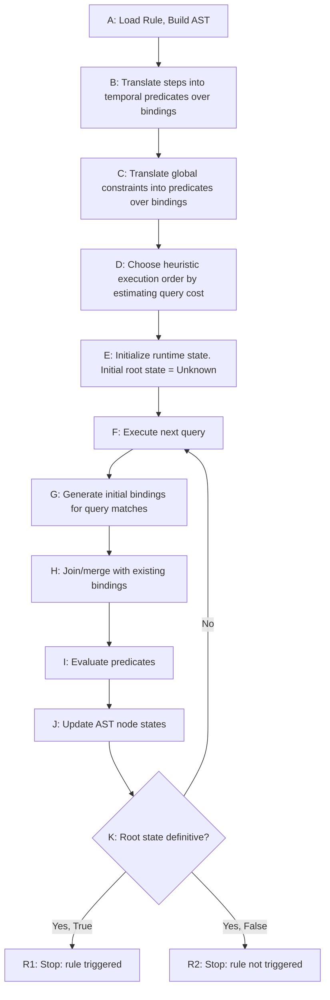

# Evaluation of Detection Rules by the Correlation Engine

This document describes the high-level flow of how the correlation engine evaluates detection rules.

A flowchart is provided for a visual overview, followed by a glossary of key concepts and more detailed explanations (still high-level) of each step in the flow.

## Flowchart

## Glossary

- **AST**: Abstract Syntax Tree, a structured representation of the rule logic.

- **Tri-state logic**: A logic system with three values: `True`, `False`, and `Unknown`. 
  Formally, the **Strong Kleene Logic** is used. The formal calculus can be found
  [here](https://www.logic.at/multlog/kleene.pdf).

- **Binding**: A mapping from query variables to concrete matched events, like `{ Q1 -> e42, Q1 -> e43 }`.

- **Predicate**: Usually a boolean, in our case a tri-state-valued condition evaluated
  over one event or over a binding.

  A predicate expresses a property that can be checked,
  such as field equality, value comparison, membership, or temporal ordering.

  Examples:
  - unary predicate on one event: `event.code == 42`
  - relational predicate on a binding: `Q1.user == Q2.user`

- **Temporal predicate**: A predicate over a binding that constrains the
  chronological relationship between events associated with different queries or steps. It evaluates timestamps.

- **Constraint predicate**: A predicate over a binding that restricts which combinations of query
  matches are considered compatible. It can be viewed as a global constraint on the binding space.
  It expresses cross-query relations such as equality of fields.
  A constraint predicate is independent of execution order and is evaluated over the events currently bound in a candidate binding.
  Examples:
  - `Q1.user == Q2.user`
  - `Q1.host == Q3.host`

- **Candidate**: A currently known potential witness for satisfying a part of a rule. A candidate is not necessarily a complete match; it may represent a single event, a partial binding, or a composed intermediate result that remains logically possible under the known constraints.

- **Candidate binding**: A binding that is currently consistent with all constraints that can already be evaluated on its bound variables. It is a partial or complete assignment of query variables to events that remains eligible to participate in a full rule match.
  A candidate binding is:
  - **valid so far** if no applicable predicate evaluates to `False`,
  - **complete** if all required query variables for the relevant subexpression are bound
  - **partial** if some variables are still unbound and some predicates therefore evaluate to `Unknown`.

- **Witness**: A complete binding that satisfies the entire rule, meaning it is a valid assignment of query variables to events that meets all structural and predicate requirements of the rule. A witness is a concrete example of a rule match and serves as evidence that the rule is triggered.

# Evaluation Flow Explanations

## A — Load rule and build AST

The evaluation starts by loading the detection rule and transforming it into an internal abstract syntax tree (AST).

The AST represents the logical structure of the rule, including:

- the rule root node
- step groupings
- query nodes such as `Q1`, `Q2`, `Q3`
- boolean operators (only `AND` and `OR` in our case)

This step defines the declarative structure of the rule **independently of runtime execution order**.

> [!NOTE] The AST must represent the logical meaning of the rule, not the chosen execution strategy. Query order is an optimization concern only and must not affect the final rule result.

## B — Translate steps into temporal predicates over bindings

Steps express chronological constraints between matched events. They should therefore be translated into explicit temporal predicates over bindings.

Example:

- `STEP 1: Q1`
- `STEP 2: Q2 || Q3`

is not just an execution hint. It means that the event bound to `Q1` must occur before the event bound to `Q2` or `Q3`, depending on the branch that satisfies the rule.

So this phase creates predicates such as:

- `time(Q1) < time(Q2)` 
- `time(Q1) < time(Q3)`

with `Qi` representing the binding variable for the events matched by query `Qi`.

These predicates are evaluated on bindings.

> [!NOTE] Step order must be modeled as rule semantics translated into temporal predicates, not as query execution order.

### Note on event gap

In case we are only interested in the order of the events,
the temporal predicate introduced above is sufficient. If we also want to enforce a maximum gap between the events,
we can easily introduce an additional predicate such as:

- `time(Q2) - time(Q1) <= max_gap`

## C — Translate global constraints into predicates over bindings

Global constraints are translated into predicates that are evaluated on bindings.

A binding is a mapping from query variables to concrete matched events, for example:

- `{ Q1 -> e1 }`
- `{ Q1 -> e1, Q3 -> e3 }`

A constraint such as:

> `Q1.user == Q2.user`

is therefore represented as a predicate over a binding:

> compare `user(b(Q1))` with `user(b(Q2))`

The result of such a predicate is evaluated using three-valued logic:

- `True` if the constraint is satisfied
- `False` if the constraint is violated
- `Unknown` if the binding does not yet contain all required variables

Constraints must not be modelled as destructive pre-filters on isolated query result sets.

They are predicates over combined bindings and **only become decidable when the relevant variables are bound.**

## D — Choose heuristic evaluation order by estimating query cost

At this stage, we determine a heuristic evaluation order for queries.

For performance reasons, the result of the heuristic should be
saved with the detection rule for later reuse and only be
re-estimated when significant changes occur in the underlying data or query performance.

We would typically want to

- a) execute highly selective queries early
  - heuristic approach: `COUNT` per query over a recent time window, e.g. last month
- b) execute 'low-cost' queries early
  - heuristic approach: runtime per query from a)
- c) prefer mandatory branches that can prove impossibility early

...which would implicitly lead to the delay of expensive, broad or unnecessary queries
and potentially to early discovery of satisfying witnesses or early proof of impossibility.

This step improves runtime efficiency but must not influence rule semantics.

As mentioned above, the chosen order is an execution strategy only. The final result must remain order-independent.

## E — Initialize runtime state

The engine initializes the runtime evaluation state, which includes:

- known result sets per query (initially empty)
- completion status per query or search space
- candidate bindings per AST node (initially empty)
- current tri-state per AST node (initially `Unknown`)
- root state initialized to `Unknown`

The initial root state is `Unknown` because, at this point, no satisfying witness has been found and no impossibility has been proven.

Notes:

- `False` must not mean "nothing found yet".
- `False` is only valid if the engine has enough completion information to prove 
  that no satisfying binding can still emerge.

## F — Execute next planned query

The engine executes the next query according to the chosen heuristic order.

The result of this step is additional runtime information, typically new query matches or completion information.

> [!NOTE] This step adds knowledge. It must not invalidate already sound conclusions.

## G Generate initial bindings for query matches

The engine collects the newly discovered matches returned by the executed query.

At this point, the engine has concrete events that satisfy a query, for example:

- `Q1` matched `e1`
- `Q3` matched `e3`

These are still raw query results, not yet combined correlation candidates.

> [!NOTE] Query matches should be accumulated monotonically. A match must not be discarded merely because no compatible partner is currently known.

Each newly discovered query match is converted into an initial binding.

Example:

- if `Q1` matched `e1`, create `{ Q1 -> e1 }`
- if `Q3` matched `e3`, create `{ Q3 -> e3 }`

These are minimal, single-query bindings and can be viewed as initial or atomic bindings.

This step creates a uniform internal representation that can later be joined with other bindings.

> [!NOTE] This step should not yet assume that a complete correlation has been found. It only creates new candidate building blocks.

## H — Join/merge compatible bindings with existing bindings

The newly created initial bindings are combined with already known bindings in the relevant AST branches.

This is the core relational step of the evaluation.

At this stage, the engine does not combine query results by execution order, but by AST semantics. The combination operator depends on the logical node in which the bindings meet.

Each AST node maintains a set of candidate bindings representing currently known possible witnesses for that subtree.

When new bindings arrive from a query leaf, they are propagated upward and combined with existing candidate bindings according to the operator of each parent node.

Two bindings are **compatible** if they can be merged into one larger binding without contradiction. In particular,
no already decidable predicate evaluates to `False`.

If a predicate cannot yet be decided because some referenced query variables are still unbound, it evaluates to `Unknown` and does not block the merge.

#### H.1 - Merge semantics at `AND` nodes

At an `AND` node, candidate bindings from the left and right child are combined by a **join.**

For two child candidate bindings `b1` and `b2`:

- if `b1` and `b2` are compatible, they are merged into `b = b1 ∪ b2`
- if they are incompatible, no merged binding is produced

This means:

- `AND` corresponds to relational combination
- only bindings that can jointly witness both sides of the `AND` survive
- constraints and temporal predicates act like join conditions

Examples of `AND` merge results:

- a larger partial binding, such as merging `{Q1 -> e1}` with `{Q3 -> e3}` into `{Q1 -> e1, Q3 -> e3}`
- a complete binding for an `AND` subtree
- a complete binding for the full rule

If no compatible partner exists for a binding at an `AND` node, that binding does not contribute a result at that node.

### H.2 - Merge semantics at `OR` nodes

At an `OR` node, bindings are accumulated by **union.**

Semantically, `OR` corresponds to set union of candidate bindings from its child branches.

This means:

- every candidate binding from the left branch remains a candidate for the `OR`
- every candidate binding from the right branch remains a candidate for the `OR`
- no compatibility check between left and right bindings is required solely because of the `OR`

### H.3 Interaction with predicates

Predicates are checked at the earliest point at which they become decidable.

This yields three cases:

- `True`: the predicate is satisfied and the binding may continue
- `False`: the binding is invalid and is discarded for that subtree
- `Unknown`: the binding remains a candidate and may become decidable later

Operationally:

- predicates spanning both sides of an `AND` typically become decidable only after a merge
- predicates local to one branch may already be decided before the merge
- predicates do not create joins by themselves; they restrict which merged bindings remain valid

### H.4 Possible outcomes of the merge step

The result may be:

- larger partial bindings
- complete bindings for a subtree
- complete bindings for the entire rule
- no result for an `AND` node if no compatible merge exists
- a union of alternatives for an `OR` node

## I — Evaluate constraint and temporal predicates

After joining bindings, we evaluate the relevant predicates on the resulting bindings.

These include:

- global constraint predicates
- temporal predicates derived from steps

Evaluation follows three-valued logic:

- `True` if the predicate is satisfied
- `False` if the predicate is violated
- `Unknown` if the binding is still incomplete for this predicate

So we handle the outcome as follows:

- discard a binding if a required predicate is `False`
- keep the binding if the predicate is `True`
- keep the binding as a partial candidate if the predicate is `Unknown`

## J — Update AST node states up to root

Based on the remaining valid bindings, the engine updates the affected AST nodes and propagates the resulting states to the rule root.

This update is not based only on individual predicate outcomes. It is based on the set of currently known valid bindings and their relation to the AST structure.

Each node is assigned a tri-state value:

- `True` if a satisfying binding is already known
- `False` if satisfaction is proven impossible for that node
- `Unknown` otherwise

## K — Root state definitive?

At this point, the engine checks whether the root node has a definitive state.

A definitive state means:

- `True`: a satisfying witness binding for the rule is already known
- `False`: it is proven that no satisfying binding can still be formed

If the root is still `Unknown`, evaluation continues with the next planned step.

## R1 — Stop: rule triggered

If the root state is definitively `True`, evaluation can stop early.

This means the engine has already found at least one valid binding that satisfies:

- the rule structure
- all predicates

A discovered satisfying witness cannot be invalidated later in this **monotonic evaluation model.**
Therefore, it is valid to stop immediately and report "rule triggered" as the final result.

## R2 — Stop: rule not triggered

If the root state is definitively `False`, evaluation can stop with "rule not triggered".

> [!NOTE] This is not equivalent to "no match found so far". It means "no satisfying match can still exist".
